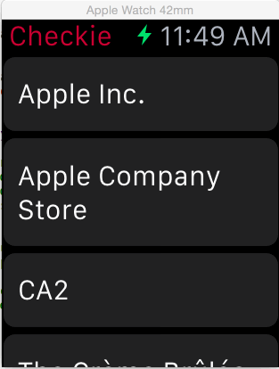

# Checkie Watch Activity Indicator

This is the image sequence I use for the activity indicator shown in [Checkie](http://checki.es) for the Apple Watch when checking in.



Since Apple doesn’t provide a stock activity indicator for the Apple Watch, I wrote this to mimic some common modern activity indicators (like [this](https://github.com/TransitApp/SVProgressHUD)). Each image in the sequence is 10x10@2x and displayed for 25 milliseconds (40fps).

Sample Use:

```
WKInterfaceImage *activityIndicatorImage = ...;
[activityIndicatorImage setImageName:@"ai"];
[activityIndicatorImage startAnimatingWithImagesInRange:NSMakeRange(0, 40) duration:1.0 repeatCount:0];
```

I’m not open sourcing the code because it’s inflexible and ugly, it was a means to an end 😄.